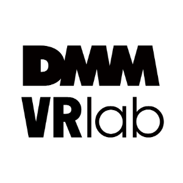
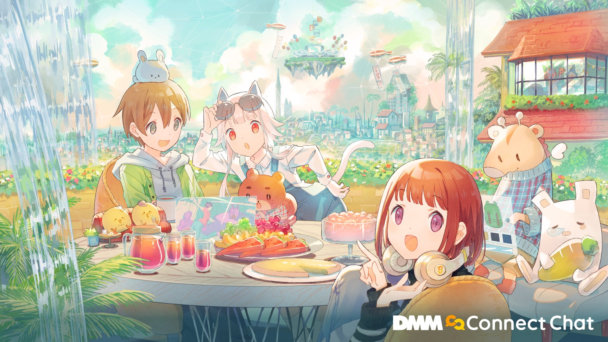
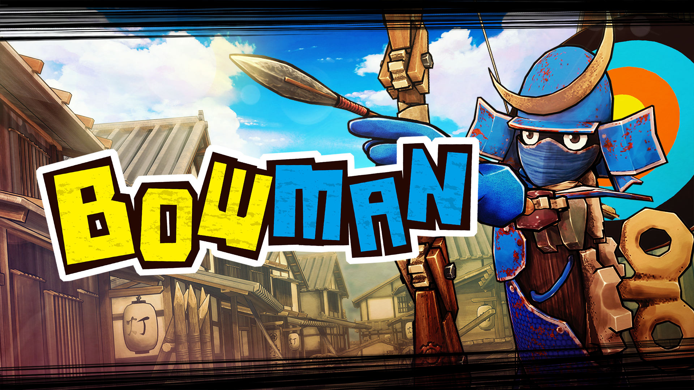
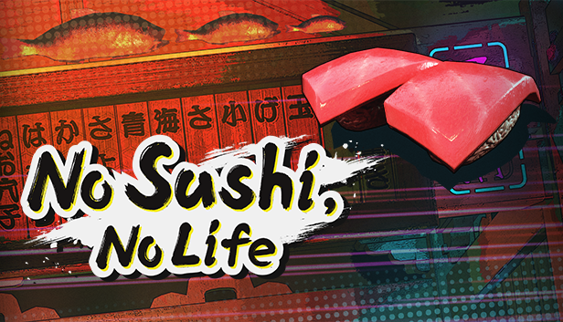

# 職務経歴書

## 基本情報

|key|value|
|---|-----|
|Name|クレウス (kleus balut)|
|Twitter|[@kleus_balut](https://twitter.com/kleus_balut)|
|VRChat|kleus_balut|

※ご連絡はTwitter DMですと反応が早いです。

## スキル
### プログラミング言語

- 業務
  - C# (Unity)
- 個人
  - C# (Unity), C++ (Arduino)

### 開発手法・利用ツールなど

 - スクラム開発
 - Git (GitHub)

### CAD等

- Autodesk Fusion360
  - 3Dプリンタを用いた小物類の設計と出力。  
  一部のモデルは[弊Booth](https://kleusbalut.booth.pm/items/942987)にて3Dプリント出力販売しています。
- DesignSpark Mechanical
- KiCad
  - 基板設計-PCB業者へ発注までひととおり経験があります。

### 電子回路設計

- 主にArduinoを用いて、特定の要件を満たすワンオフの回路を組むのが得意です
  - 詳細は[以前の仕事](#以前の仕事)より

## 強み

- 実体験から必要なものを発想し、製作することができる
  - 例 : [VIVEBatteryInfo](https://kleusbalut.booth.pm/items/969809) 
- 基板設計から筐体設計、出力までワンストップで行える
  - 例 : [エアガン用残弾カウンター](https://twitter.com/kleus_balut/status/744148231492247552?s=20)
- 外部向けの技術記事の執筆ができる
  - 例 : [DMM VR ConnectのマイアバターをLooking Glass Portraitに表示するアプリをつくる](https://inside.dmm.com/entry/2021/05/21/DMMVRConnect06)
- 本番に強い
  - 例 : VRライブ本番のタイムキーパーや、テレビの生中継用機材の準備、VR体験会の対応、VR登壇など
    - 本番までに必要な機材などを選定し準備のうえ、基本的にバックアップ体制(プランB)を用意します。

## 興味のあること

- VR
  - VR-SNSでのプレゼンス向上手法の検討
  - アバター利用によるユニフォーム効果の検証
  - VRとリアルワールドの相互接続手法の検討
- AR
  - 実用的な情報表示手法の検討
  - AR-VR間のシームレスな体験移行方法の検討

## 職務経歴

### 2019/04 - 現在 : 合同会社DMM.com VRlab (VR事業部)

職務 : エンジニア

#### VR開発

---
- **[Connect Chat](https://store.steampowered.com/app/1424930/Connect_Chat/) VR-SNS/VRイベントプラットフォーム**

  
  <!-- めっちゃかわゆ -->

  - 期間 : 2021/07 - 現在
  - 担当 : Unityエンジニア
  - 環境 : Unity, C#
  - 主な担当業務
    - UI刷新
    - バグ修正
    - 本番オペレーション
      - VRライブ
      - YouTubeLive配信
    - プロジェクト立上時の原案参加 (VR-SNSユーザー視点でのアドバイスなど)

---
- **[販売終了] [BOW MAN (PC版)](https://store.steampowered.com/app/1159480/BOW_MAN/) カジュアルVRゲーム**

  

  - 期間 : 2019/04 - 2019/12
  - 担当 : Unityエンジニア
  - 環境 : Unity, C#
  - 主な担当業務
    - プロトタイプ作成
    - 簡易なビルド・パブリッシングツール作成
    - UI実装
    - パブリッシング (Oculus/Steam)
  - コメント
    - 「配信映えするVRゲームを作る」というコンセプトのもと、MODを使わず最初から配信に便利な機能を搭載していました。   
    主に最初期のプロトタイプ作成、簡易な社内向けツール作成、UI実装などを担当しました。   
  ※所属本部の移籍・方針転換により終売

---
- **[販売終了] [No Sushi, No Life](https://store.steampowered.com/app/1481430/No_Sushi_No_Life/) カジュアルVRゲーム**

  

  - 期間 : 2019/10 - 2020/01
  - 担当 : Unityエンジニア
  - 環境 : Unity, C#
  - 主な担当業務
    - メインプログラム
    - ディレクションの一部
      - 詳細仕様策定
      - スケジューリング など
    - パブリッシング (Steam)
  - コメント
    - カジュアルVRゲーム第二弾です。   
    コンセプトは「短期間でカジュアルVRゲームを作ってリリースする」というもので、全ての工程を概ね3か月以内に完遂しました。   
    主にメインプログラムを担当しました。   
    ※所属本部の移籍・方針転換により終売

---
#### SDK開発

- **[DMM VR Connect SDK](https://github.com/dmm-com/vrlab-dvrsdk)**

  

  - 期間 : 2019/12 - 2021/06
  - 担当 : Unityエンジニア
  - 環境 : Unity, C#
  - 主な担当業務
    - 機能開発
    - サンプル追加
    - ドキュメント作成

#### VR R&D (プロトタイピング)

  - 社内検証用モック作成 (1案件あたり2-4週間を3-4案件)
    - 期間 : 2020/08 - 2020/12
    - 担当 : Unityエンジニア
    - 環境 : Unity, C#

#### 執筆記事
  - [DMM VR ConnectのマイアバターをLooking Glass Portraitに表示するアプリをつくる](https://inside.dmm.com/entry/2021/05/21/DMMVRConnect06)
  - [DMM VR labのCES 2020参加レポート](https://inside.dmm.com/entry/2020/01/10/CES2020-DMMVRlab) ※[パトリック](https://twitter.com/PatrickClacey)と共同編集
  - [バ美肉エンジニアのXRDC2019参加レポート](https://inside.dmm.com/entry/2019/11/08/xrdc-2019-vengineer-vrlab) ※メンバーと共同編集

#### その他業務
  - 備品管理
  - 亀山会長VRアバターシステムのセットアップ ([VirtualMotionCapture](https://vmc.info/)使用)
    - VRアバターシステムのプロト作成 (Zoomのアバター機能のようなもの)
  - 社内VR体験会開催 (社員および取締役以上向け)
  - 社内業務取り次ぎ

## 以前の仕事

### 2014 - 2018頃 : 個人事業主

案件の一部:
- NHK様 [「旧・陸中山田駅　ＡＲ再現プロジェクト」](https://www.nhk-ep.co.jp/arproject-20180810/)
  - (発注 : ホロラボ・デザイニウム様) 生中継で使用するHoloLensのセットアップのサポートを行いました
- リクルート・テクノロジー様 [「ATL-MR リアル-バーチャル勉強会」](https://atl-hiroo.recruit-tech.co.jp/2018/11/real-virtual-meeting/)
  - (発注 : デザイニウム様) HoloLens経由でリアル-バーチャル間で登壇しました
- VR危険予知動画向けの連動コントロールボックス
  - PCに接続し、指定されたタイミングでサンダーのスイッチをON-OFFするもの

### 2012 - 2014頃 : ソーシャルゲーム会社 2社

- 社内情シス
- 総務

### 2010頃 : SIer

- VMware vSphere4.x 環境構築/運用
- Windows2003サーバーのキッティング/ラッキング
- Ciscoスイッチの簡単な設定 (CCNA講習受講済)

## 個人での活動

### 個人プロジェクト
* [VIVEBatteryInfo](https://kleusbalut.booth.pm/items/969809) VRChat等VRアプリで使える、コントローラー/トラッカーバッテリー残量表示アプリ＋α
* [アバターARカメラ撮影アプリ](https://kleus-balut.fanbox.cc/posts/1860508) Unity AR Foundationで作られたクロスプラットフォームのアバターARカメラ撮影アプリ
* その他、[3Dプリンタおよび電子工作による製作物](https://twitter.com/i/moment_maker/preview/791109179855347712)

### 過去の登壇資料
*  歌舞伎座.tech#15 LT [Unity初心者がソーシャルVR向けの補助ツールを作った話](https://youtu.be/OiQqKWxRLE4)

### 執筆記事(個人)
* [VR向けUI/UXの検討と、その歴史](https://qiita.com/kleus_balut/items/bc7cb294044e303e6940) 
* [携帯ゲーム機型PC「GPD WIN」で、おすすめ名作フリーゲーム10選をプレイレビュー](http://www.moguragames.com/entry/gpd-win-freegame/)
